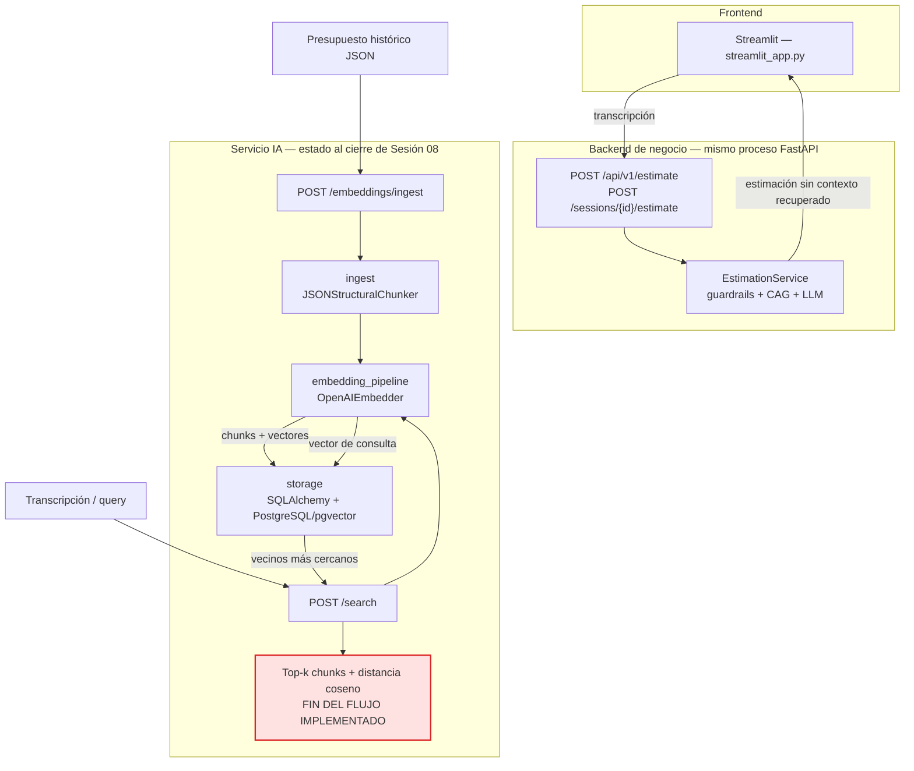
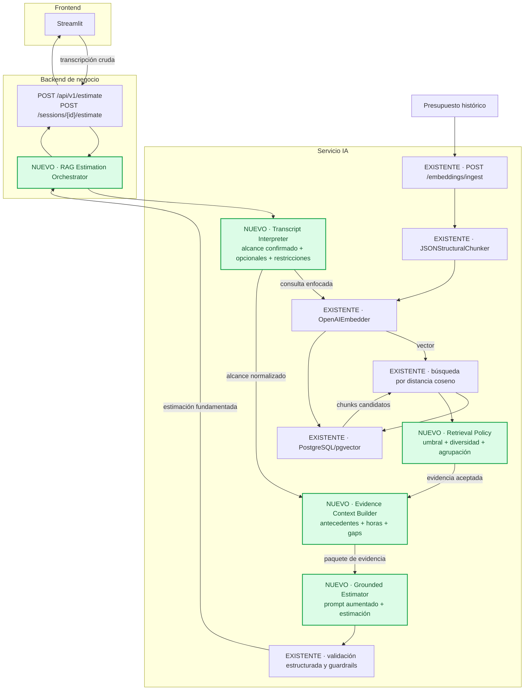

# Diagnóstico arquitectónico — Sesión 09 (pre-work)

## 1. Diagrama de la arquitectura actual



Las tres capas son lógicas: en este repositorio el backend de negocio y el servicio IA se ejecutan
dentro del mismo proceso FastAPI. El frontend usa los endpoints de estimación, mientras que los
endpoints de ingesta y búsqueda quedan expuestos en paralelo. El código no contiene directorios
literales `ingest/` y `storage/`; esas responsabilidades están en `JSONStructuralChunker` y
`app/db/`, respectivamente. La búsqueda termina al devolver chunks: no existe una conexión desde
ese resultado hacia `EstimationService`.

---

## 2. Trace anotado de `02_ambiguous.txt`

Antes del trace verifiqué que el corpus tuviera únicamente los tres presupuestos históricos y sus
seis chunks:

```bash
docker compose exec -T postgres psql -U estimator -d estimator \
  -c "SELECT COUNT(*) AS documents FROM documents;" \
  -c "SELECT COUNT(*) AS chunks FROM chunks;"
```

```text
 documents
-----------
         3

 chunks
--------
      6
```

### Paso 1 — Embeber la transcripción completa

Comando ejecutado:

```bash
.venv/bin/python examples/trace_s09.py examples/transcripts/02_ambiguous.txt
```

El script usa directamente `text-embedding-3-small`, el mismo modelo que emplean la ingesta y
`POST /search`, porque el servicio actual no expone el vector crudo mediante HTTP.

```text
STEP 1 — EMBEDDING
model: text-embedding-3-small
dimensions: 1536
norm: 0.999691
first_component: 0.00623322
last_component: 0.01901245
```

**Comentario.** El vector de 1536 dimensiones y norma cercana a 1 representa toda la reunión como
un único punto semántico. Mezcla la señal útil —tienda online, catálogo, stock, pagos y panel— con
historia personal, dudas, conversación social y posibilidades futuras; no distingue alcance firme
de ideas tentativas.

### Paso 2 — Búsqueda semántica (top-5)

La segunda llamada ejecutada por el script equivale al siguiente comando reproducible:

```bash
jq -Rs '{query: ., k: 5}' examples/transcripts/02_ambiguous.txt \
  | curl -sS http://localhost:8000/search \
      -H 'Content-Type: application/json' \
      --data-binary @-
```

Respuesta cruda obtenida (el campo `query` contiene literalmente el contenido completo de
`02_ambiguous.txt`, mostrado en el comando anterior):

```json
{
  "query": "Reunión exploratoria — sin título claro todavía\nCliente: Rubén Castaño (gerente, Casa Castaño — tienda de productos gourmet)\nConsultor: equipo de estimación\nFecha: primera toma de contacto\n\n[00:00:08] Consultor: Buenas, Rubén. Cuéntame, ¿qué os ronda por la cabeza?\n\n[00:00:15] Rubén: Pues mira, es que llevamos dándole vueltas un tiempo y no sé muy bien por dónde\nempezar, por eso os hemos llamado. Tenemos la tienda física de toda la vida, la de mi padre, llevamos\ncon ella desde el noventa y dos. Conservas, vinos, aceite, esas cosas. Y claro, vemos que el mundo va\npor otro lado y que hay que dar el salto, pero no tenemos ni idea de tecnología, ¿eh?, te lo digo ya.\n\n[00:01:02] Consultor: Sin problema, para eso estamos. ¿Qué te gustaría conseguir?\n\n[00:01:09] Rubén: A ver, lo ideal sería vender por internet, eso seguro. Que la gente entre, vea los\nproductos y compre, ¿no? Pero también... mira, mi sobrina, que de esto sabe más que yo, me dice que\nlo importante hoy es fidelizar. Que un cliente que repite vale más que diez que vienen una vez. Y yo\npienso, pues igual algo de puntos, o un club, no sé, que la gente acumule y luego canjee. Eso me\ngustaría. Aunque tampoco quiero liarlo mucho al principio, ¿eh?\n\n[00:02:05] Consultor: Vale. ¿Y cómo te imaginas el día a día gestionándolo?\n\n[00:02:12] Rubén: Pues eso es lo otro. Yo necesito ver qué se vende. Un panel, algo donde yo entre\npor la mañana con el café y vea los pedidos del día, lo que más se mueve, el stock... que ahora lo\nllevo en un cuaderno, te lo juro. Mi mujer me dice que parezco del siglo pasado. Algo visual, con sus\ngráficas, para tomar decisiones. Eso lo veo clarísimo, lo del panel de control.\n\n[00:03:01] Rubén: Ah, y oye, una cosa importante: que la gente pueda pagar con tarjeta, claro. Eso es\nfundamental, que el pago sea fácil y seguro, que no se me vayan en el último paso. He oído que mucha\ngente llena el carrito y luego no paga, y eso no puede ser.\n\n[00:03:40] Consultor: Totalmente. ¿Tenéis volumen previsto, mercados, algo de eso?\n\n[00:03:47] Rubén: Uf, pues no sabría decirte. España de momento, supongo. Aunque un primo en Francia\nme dice que allí los productos españoles se venden solos, así que quién sabe, igual más adelante.\nPero no me hagas mucho caso con eso. Y mira, también pensaba... no sé si es mucho pedir, pero estaría\nbien mandar un correo cuando alguien compra, para que sepa que va su pedido. Detalles, ¿sabes? Que el\ncliente se sienta atendido como en la tienda de siempre.\n\n[00:04:35] Rubén: En fin, que tampoco quiero marearos. Que sé que esto es un mundo. Lo que necesito\nes que me digáis vosotros, que sois los que sabéis, qué se puede hacer y más o menos cuánto cuesta.\nYo de presupuestos de software ni idea, ¿eh? Decidme un número y vemos.\n\n[00:05:02] Consultor: Tranquilo, Rubén, lo recogemos y te volvemos con una propuesta. Gracias.\n",
  "k": 5,
  "search_time_ms": 1013,
  "results": [
    {
      "chunk_id": 4,
      "document_id": 3,
      "chunk_type": "budget_component",
      "content": "[Project: E-commerce platform migration from Magento to a headless architecture]\n[Client sector: ecommerce | Year: 2024 | Main tech: nodejs]\n\nComponent: Product catalog service\nDescription: Headless product catalog with variant management, inventory sync, and full-text search over product attributes.\nTech stack: nodejs, postgresql, elasticsearch\nComplexity: medium\nEstimated hours: 200.0",
      "distance": 0.6555344908394501,
      "metadata": {
        "year": 2024,
        "budget_id": "BUD-2024-021",
        "complexity": "medium",
        "component_id": "CATALOG-001",
        "client_sector": "ecommerce",
        "estimated_hours": 200.0,
        "main_technology": "nodejs"
      }
    },
    {
      "chunk_id": 5,
      "document_id": 3,
      "chunk_type": "budget_component",
      "content": "[Project: E-commerce platform migration from Magento to a headless architecture]\n[Client sector: ecommerce | Year: 2024 | Main tech: nodejs]\n\nComponent: Database migration from MySQL to PostgreSQL\nDescription: Zero-downtime migration of the legacy Magento MySQL database into the new PostgreSQL schema, including data validation and rollback plan.\nTech stack: nodejs, mysql, postgresql\nComplexity: high\nEstimated hours: 140.0",
      "distance": 0.7236443532938771,
      "metadata": {
        "year": 2024,
        "budget_id": "BUD-2024-021",
        "complexity": "high",
        "component_id": "MIGRATE-002",
        "client_sector": "ecommerce",
        "estimated_hours": 140.0,
        "main_technology": "nodejs"
      }
    },
    {
      "chunk_id": 3,
      "document_id": 2,
      "chunk_type": "budget_component",
      "content": "[Project: Mobile banking API with OAuth 2.0 authentication and PSD2 compliance]\n[Client sector: finance | Year: 2024 | Main tech: ruby_on_rails]\n\nComponent: PSD2 compliance module\nDescription: Strong customer authentication (SCA) flows and consent management required for PSD2 regulatory compliance in the EU.\nTech stack: ruby_on_rails, postgresql\nComplexity: high\nEstimated hours: 160.0",
      "distance": 0.7550322503629425,
      "metadata": {
        "year": 2024,
        "budget_id": "BUD-2024-014",
        "complexity": "high",
        "component_id": "PSD2-002",
        "client_sector": "finance",
        "estimated_hours": 160.0,
        "main_technology": "ruby_on_rails"
      }
    },
    {
      "chunk_id": 2,
      "document_id": 2,
      "chunk_type": "budget_component",
      "content": "[Project: Mobile banking API with OAuth 2.0 authentication and PSD2 compliance]\n[Client sector: finance | Year: 2024 | Main tech: ruby_on_rails]\n\nComponent: OAuth 2.0 authentication backend\nDescription: Implementation of OAuth 2.0 flows (authorization code, refresh token) with JWT-based session management, multi-tenant token isolation, and rate limiting per client.\nTech stack: ruby_on_rails, postgresql, redis\nComplexity: high\nEstimated hours: 120.0",
      "distance": 0.7668291557739908,
      "metadata": {
        "year": 2024,
        "budget_id": "BUD-2024-014",
        "complexity": "high",
        "component_id": "AUTH-001",
        "client_sector": "finance",
        "estimated_hours": 120.0,
        "main_technology": "ruby_on_rails"
      }
    },
    {
      "chunk_id": 7,
      "document_id": 4,
      "chunk_type": "budget_component",
      "content": "[Project: Patient record management system with HIPAA-compliant audit logging]\n[Client sector: healthcare | Year: 2023 | Main tech: python_django]\n\nComponent: Patient record CRUD API\nDescription: Core API for creating, reading, updating patient demographic and clinical records with field-level encryption at rest.\nTech stack: python_django, postgresql\nComplexity: high\nEstimated hours: 180.0",
      "distance": 0.7782861185616083,
      "metadata": {
        "year": 2023,
        "budget_id": "BUD-2023-007",
        "complexity": "high",
        "component_id": "RECORDS-002",
        "client_sector": "healthcare",
        "estimated_hours": 180.0,
        "main_technology": "python_django"
      }
    }
  ]
}
```

**Comentario.** El primer resultado sí detecta la intención principal de comercio electrónico,
pero el segundo ya comparte solamente el sector y el presupuesto padre. Los tres resultados
restantes pertenecen a finanzas y salud y tienen distancias cercanas entre sí (`0.7550`–`0.7783`),
señal de que el top-5 está rellenándose con evidencia débil.

### Paso 3 — Lectura de los chunks devueltos

1. **BUD-2024-021 · ecommerce · Product catalog service · distancia 0.6555.** Es relevante: el
   cliente necesita catálogo, visualización de productos y control de stock. No cubre pagos,
   pedidos, fidelización ni el panel de gestión, pero es un buen antecedente parcial.
2. **BUD-2024-021 · ecommerce · Database migration · distancia 0.7236.** La coincidencia de sector
   es correcta, pero el chunk no es relevante para el alcance descrito. El cliente no ha pedido una
   migración desde Magento/MySQL ni ha mencionado un sistema anterior.
3. **BUD-2024-014 · finance · PSD2 compliance · distancia 0.7550.** No es relevante. El pago con
   tarjeta no convierte el proyecto en una plataforma financiera ni implica PSD2, SCA o gestión de
   consentimientos bancarios.
4. **BUD-2024-014 · finance · OAuth backend · distancia 0.7668.** Es poco relevante. Una tienda
   necesitará usuarios y seguridad, pero la transcripción no pide OAuth, multi-tenancy, JWT ni rate
   limiting, y el sector financiero distorsiona la comparación.
5. **BUD-2023-007 · healthcare · Patient record CRUD API · distancia 0.7783.** No es relevante.
   Solo comparte la idea genérica de gestionar datos; ni el dominio clínico ni el cifrado de
   historiales ayudan a fundamentar esta estimación de e-commerce.

---

## 3. Diagnóstico: cinco fallos identificados

### Fallo 1 — La transcripción completa diluye la intención de búsqueda

- **Problema observado:** Un único vector representa toda la conversación, incluidas dudas,
  anécdotas y posibilidades futuras. Aunque recupera correctamente el catálogo en primer lugar,
  después mezcla migraciones, PSD2, OAuth e historiales clínicos.
- **Causa probable:** La consulta se embebe sin separar requisitos confirmados, ideas opcionales y
  ruido conversacional, mientras que los documentos comparados son chunks cortos y específicos.
- **Propuesta de solución:** Añadir una etapa de interpretación que convierta la transcripción en
  una consulta enfocada con sector, alcance confirmado, features y restricciones.

### Fallo 2 — El top-5 devuelve evidencia débil por obligación

- **Problema observado:** Con solo seis chunks almacenados, `k=5` devuelve el 83 % del corpus. Los
  puestos 3–5 tienen distancias entre `0.7550` y `0.7783` y pertenecen a finanzas o salud.
- **Causa probable:** La búsqueda aplica únicamente un límite fijo; no existe umbral de relevancia
  ni una salida explícita para indicar que no hay suficientes antecedentes útiles.
- **Propuesta de solución:** Incorporar una política de recuperación que descarte resultados por
  encima de un umbral calibrado y permita devolver menos de `k` chunks.

### Fallo 3 — Los chunks se ordenan sin contexto de presupuesto

- **Problema observado:** Los dos primeros resultados pertenecen a `BUD-2024-021`, pero solo el
  catálogo es útil. La migración de Magento aparece segunda por compartir presupuesto y sector,
  aunque no existe ninguna migración en la transcripción.
- **Causa probable:** El ranking trata cada chunk de forma aislada y no agrega evidencia por
  presupuesto ni comprueba la cobertura de cada feature solicitada.
- **Propuesta de solución:** Añadir agrupación por presupuesto y una selección diversa por feature,
  conservando solo los componentes que aporten evidencia al alcance confirmado.

### Fallo 4 — El corpus no cubre el alcance solicitado

- **Problema observado:** El único antecedente de e-commerce aporta catálogo e inventario, pero no
  hay chunks útiles para checkout, pago con tarjeta, pedidos, dashboard, emails o fidelización. El
  buscador rellena los huecos con otros sectores.
- **Causa probable:** El corpus contiene únicamente tres presupuestos y seis componentes, con un
  solo presupuesto de e-commerce y cobertura funcional muy limitada.
- **Propuesta de solución:** Ampliar y medir la cobertura del corpus con presupuestos históricos que
  representen checkout, pagos, operaciones, analítica y fidelización antes de confiar en el RAG.

### Fallo 5 — La recuperación no participa en la estimación

- **Problema observado:** `POST /search` termina devolviendo los chunks al cliente, mientras que
  `EstimationService` construye su prompt y llama al LLM por un camino independiente. Ninguna hora
  recuperada aparece como evidencia de una estimación generada.
- **Causa probable:** No existe un módulo que coordine interpretación, recuperación, construcción
  de contexto y generación, ni un formato para inyectar los antecedentes en el prompt.
- **Propuesta de solución:** Añadir un flujo RAG de estimación que ensamble contexto verificable a
  partir de los resultados aceptados y lo entregue al generador junto al alcance normalizado.

---

## 4. Propuesta de evolución arquitectónica



`Transcript Interpreter` separa el alcance confirmado de las ideas opcionales y produce una
consulta enfocada. `Retrieval Policy` filtra, agrupa y diversifica los candidatos; `Evidence Context
Builder` combina los chunks aceptados con el alcance y explicita tanto las horas históricas como los
huecos sin evidencia. `Grounded Estimator` genera la estimación usando ese paquete, y `RAG
Estimation Orchestrator` conecta todo el recorrido desde los endpoints existentes. Si solo pudiera
construir una pieza primero, elegiría el orquestador con el ensamblado mínimo de contexto: es el seam
que hoy no existe y sin él ningún resultado recuperado puede influir en la estimación.
